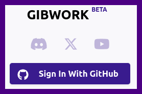
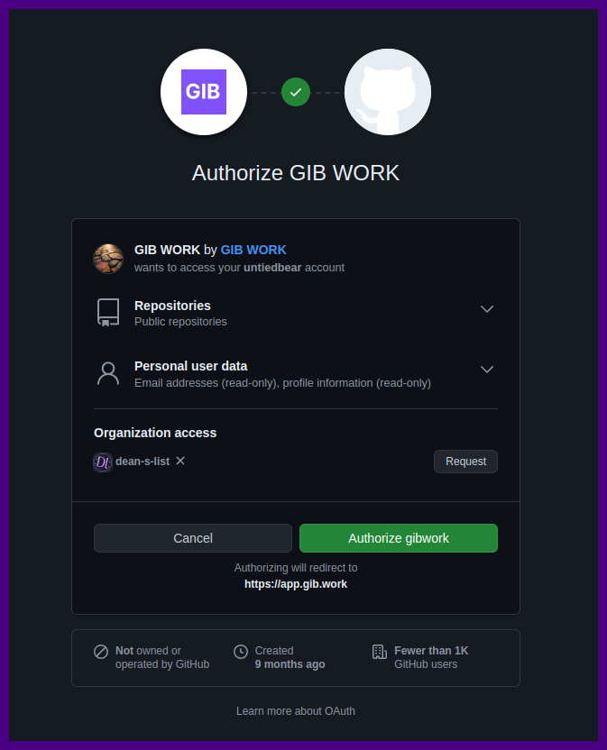
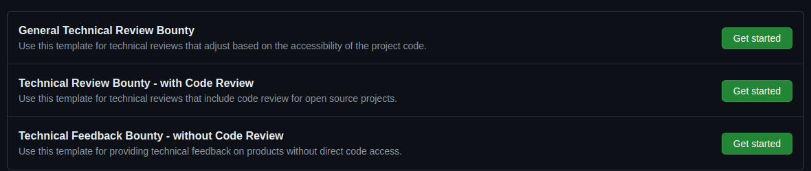
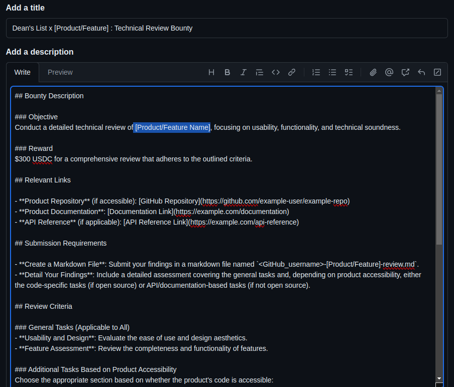
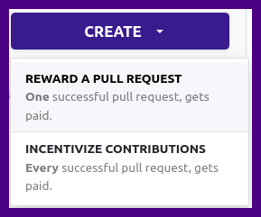
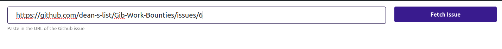
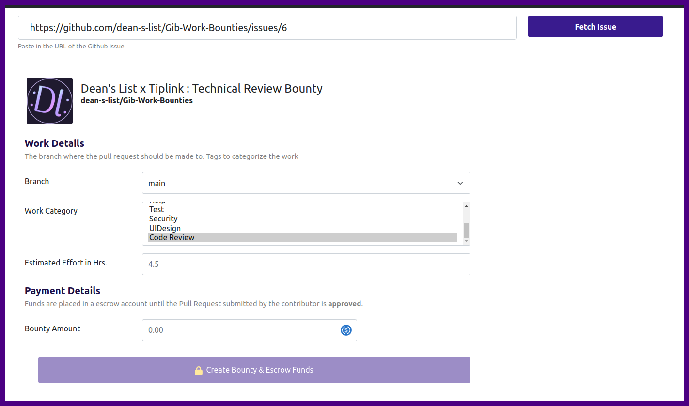

# Creating a Bounty on gib.work Using GitHub Issues

This guide will walk you through the process of creating a bounty on gib.work, utilizing GitHub issues with predefined templates.

## Step-by-Step Instructions

### Step 1: Go to gib.work

Navigate to the [gib.work platform](https://app.gib.work) to begin the process.

### Step 2: Sign In with GitHub

Sign in using your GitHub account to link your GitHub and gib.work activities.

### Step 3: Authorize GIB WORK

Authorize gib.work to access your GitHub information. Request organization access if needed to proceed with bounty creation.

### Step 4: Create New Issue on GitHub

Navigate to the issues section of your repository:
[Dean's List Gib Work Bounties Issues](https://github.com/dean-s-list/Gib-Work-Bounties/issues)

Click 'Create New Issue'.

### Step 5: Choose a Template

Select the appropriate template based on the customer's requirements:
- **Technical Review Bounty - with Code Review**: If a code review is specifically required.
- **Technical Feedback Bounty - without Code Review**: For technical reviews that include API tests or documentation reviews but no direct code access.
- **General Technical Review Bounty**: For general technical reviews where it is not specified or known if the process involves open source.

### Step 6: Fill in the Template

Replace placeholders in the chosen template with specific details about the bounty you are creating.

### Step 7: Create Bounty on gib.work

On gib.work, click 'Create' and choose 'Reward a Pull Request' for bounties where multiple submissions are possible but only the most fitting one gets rewarded.

### Step 8: Link GitHub Issue

Copy and paste the URL of the issue you created into the designated field on gib.work.

### Step 9: Set Bounty Details

After fetching the issue, select the work category, fill in the estimated effort in hours, and set the bounty amount before you finalize by clicking 'Create Bounty & Escrow Funds'.

## Conclusion

Following these steps, you will have successfully created a bounty on gib.work. This process ensures a structured approach to sourcing contributions and rewarding the most fitting submissions.
