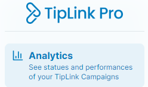

# Introduction
This technical review is performed as a response to [Dean's List Bounty #6 for TipLink](https://github.com/dean-s-list/Gib-Work-Bounties/issues/6). The review has been performed in the following stages:

1. [Initial Review](#o1) - meant to generate first-impressions, initial considerations, and highlight areas of further review.
2. [Implementation Test](#o2) - meant to generate understanding of any turtorial's ease-of-use, correctness of examples, and aesthetic value.
3. [Code Review](#o3) - meant to consider code quality, completeness, and documentation.
4. [Summary](#o4) - meant to offer suggestions and summarized feedback.

I will write in imperativeswhen suggesting updates and changes, but I completely recognize that some of the suggestions outlined have to be weighed against a number of other factors.

Thanks for your time in reading this review.

# Initial Review
## Docs Website
1. Website is clean and easy to understand, but the largest question that comes to mind is what audience is the documentation website aimed at? Potentially it may be worthwhile to consider a dual channel approach where the documentation website directly has a path for TipLink developers vs recipients (which goes to your excellent consumer-facing tutorials/site/faq), that way if a recipient finds themself on this site they have a clear path out.
2. The first CTA on the site is directing what appears to be offering a 20-minute tutorial *video*, based on their being a time mentioned. Since the tutorial is not recorded and instead is linking to relatively standard documentation, it may be worthwhile to change the icon to an open book or remove the '20 mins' and stopwatch entirely.
3. The bottom simple explanation is great, perhaps arrows showing it is a procedure between the steps is warranted,
4. The link out the NPM on the navbar that persists on the entire docs site feels excessive, especially considering the quick start guide covers its use well. Perhaps it would be better suited in the footer.
5. [Getting Started](https://docs.tiplink.io/docs/category/getting-started) section is clear.
6. [Api Reference > TipLinkClient](https://docs.tiplink.io/docs/api-reference/client) (Pro) should use h4 headers for each individual class definition to allow deep linking and to give them more separation. It also would be valuable to have a 1-2 sentence description of what each class is, the most notable example is that a 'Campaign' has never been described or referenced in the docs until you first see it as a class. 'Dispenser' suffers the same problem, but is a more clear term, so the lack of explanation is less problematic.
7. [Extended Examples](https://docs.tiplink.io/docs/category/extended-examples) are excellent, and I look forward to using them during testing. The warning on 'Transactions Guide' is duplicated, but I recognize that may have been intentional.
8. I would expect the wallet adapter to have some documentation.

## Github
1. It would be nice to have a public member or members listed on the organization, especially since the team is not private.
2. Ditto to have the most critical repo pinned.

## Various Other Items
1. [TipLink Pro](https://tiplink.io/pro/campaigns) sidebar has a small spelling error, should be statuses or status, not statues (See below)
    * 
2. Feature request - it would be great if a ui-spawned campaign can request that a minter shares some details with the organizer, such as email, socials, or a custom field. Ideally it could be configured to be pre or post mint.
3. Feature request - that api emails could have customizable text, as the default message limits the flexibility of how you can use it in a program.

# Implementation Test
## Quickstart
To run this test, I'm going to use the solana dapp scaffold template, and create a basic site to test out each of TipLink's features and implementation guides.

## Areas of Focus
0. [Prior to testing out the dev functions, I am going to test out the ui methods of these functions.](#it0)
1. [Use the quickstart guide/basic examples for the bare minimum fuctionality.](#it1)
2. [Create a TipLink wallet transaction](#it2)
3. [Create a TipLink QR Code](#it3)
4. [Create a TipLink Mint](#it4)
5. [Create/initiate an emailed TipLink](#it5)
6. [Implementation Test Summary](#it6)

## 0. UI Methods
The site UI is excellent, easy to understand, and aesthetically pleasing. Very well done!

1. When you are logged in, the pro page does not auto-forward you to the dashboard, while this may make sense for someone who has never visited the dashboard before, the routing should probably be updated at a minimum after they have created a campaign.
2. The analytics table will be hard to use when custom digital assets are created, I believe there should be some roll-up or filtering if multiple campaigns use the same collection ID.
3. The repeated checking authentication breaks between pages takes a good deal of time and can be halting to someone's workflow
4. I love the hinting of new features, great UI choice!

## 1. Basic Functionality
1. Example is clear, makes sense, and is added to a project easily.

## 2. Wallet Transaction
Upon getting the pieces added for this, a slew of problems were encountered, but the core of it is:

1. Tiplink’s listed TS dependency is "typescript": "^4.7.4", this older version of typescript conflicts with a number of newer solana libraries, such as @solana/codecs.
2. Because the api calls to and front end wallet interaction functionality need to be separated in next.js, the implementation guide code is difficult to immediate integrate, it may be worthwhile to help separate the server and frontend interactions a bit in the code examples, as this will help with a variety of frameworks, not just next.js and react.
3. 'TIPLINK_ORIGIN_OVERRIDE' would be helpful to have mentioned here as well, along with any other available env variables.

## 3. QR Code
Implementation makes immediate sense, great feature.

1. Given code doesn't work immediately in next.js, but I don;t think it is on your team to consider every potential framework/implementation. It may be worthwhile though for this guide to simplify and have the string src direct link instead of loading for an imported component.

## 4. Mint
Same general issue as wallet above, it might make sense to separate backend and frontend pieces here to ease implementation for a variety of frameworks.

1. It would be helpful to add additional comments and separation for the required and optional params, clearly dictating how each is used, and marking places where things are in-development but not yet released (such as the theme line).
2. Since general api key is auto generated now you can remove the comment about discord
3. It might be worthwhile to show the implementation using the wallet-adapter instead of referencing a generated keypair
4. [Please see related security issue, also directly reported to team when discovered](#s1)
5. Minor spelling issues, such as 'Informatino', can be cleaned up when making other changes.

## 5. Emailed TipLink
Implementation was easy, another great feature
1. Team provided email api key, but I do recommend an automated generation method on your site.
2. 'mail' doesn't seem to match your naming conventions, would consider relabeling before use starts expanding
3. [Please see related feature request](#fr1)

## 6. Implementation Test Summary
Overall everything worked well and as expected. With the exception of the highlighted security concern, there were no major flaws I was able to find in the implementation test. I experienced some gateway timeout when creating mints, but not frequently enough to be a concern with enabled retries.

I recommend the documentation also include a pre-built next.js template that highlights all available TipLink features and is already implemented with your wallet-adapter, api calls to your product, and @solana/web3.js, as a living example like that could really speed up someones implementation of your product and it wouldn't take too long to stand up. The opos outliers repo is a great example that could be further expanded.

There are clearly a wide array of uses cases for your product, it is well designed, and I look forward to implementing it on other projects I am working on.

# Code Review
Throughout the implementation, I spent a lot of time reviewing the following repos:
* [tiplink-open-source](https://github.com/TipLink/tiplink-open-source) (and the old tiplink-api)
* [opos-outliers](https://github.com/TipLink/opos-outliers)

## Important Issues
*  **tiplink-open-source/api/sec/client.ts:1074**
    * It is possible to avoid paying fees and just having the tiplink fee wallet pick up the mint cost instead. If an underfunded or spammed tx hash is given as a mint param in a client.mints.create(mintParams) request, the only check done against it is to ensure it exists as a string.
    * While this a malicious attack vendor could only drain the fees wallet and would have to be spent on mints created by tiplink, perhaps the larger concern is that **if someone were to build a faulty setup and wasn't paying fees properly on rapidly generated mints, this could drain the fee wallet and thus break the mint functionality for all users.**

## Minor Issues
* Everything else was generally clear and clean.
* It may be worthwhile to break client.ts down into separate files a bit, specifically for some of the mint and campaign actions.
* Some of the items that seem to be available, such as the campaign find, should be included in the docs as well.
* Some stray TODOs should be reviewed to confirm they are still in the works, and ideally also point to a public roadmap of feature developments if such a roadmap exists.

# Summary
I really loved going through TipLink's features, code, and documentation. As the product offering continues to expand, if you are able to keep the same excellent and clean user-facing interface, and your documentation is slightly upgraded to have the same standard of quality, TipLink will easily win over many more users and developers.

Finally, I again think it would be very valuable to have one simple & clean next.js template that has all of your important features and can be used to demo the product quickly for a new developer trying to work with it.

Thank you for your time.